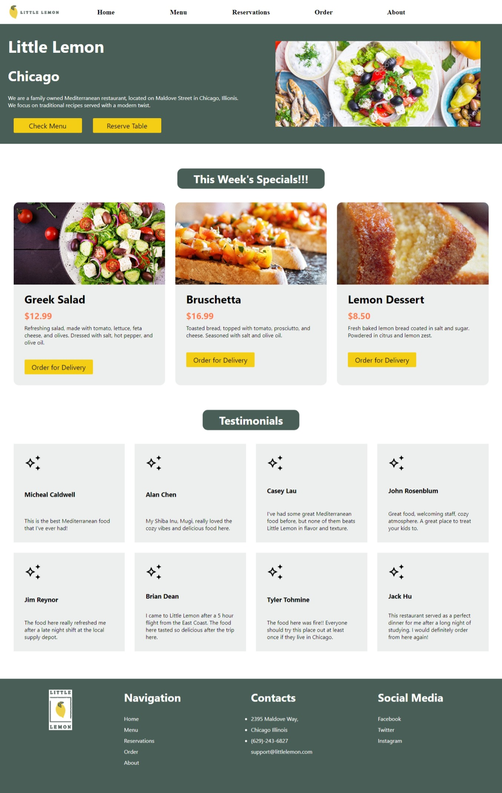

# Little Lemon Restaurant

Final capstone project for Meta Frontend React Developer Professional Certificate on Coursera

### Home Page

### Description
A detailed and responsive website with resevation feature. The application was built using React & CSS.

### Install and Run:

- Run 'npm start' on the reserve-a-table folder

### Author

- [Mo Faried](https://m-faried.github.io/m-faried-portfolio/)
